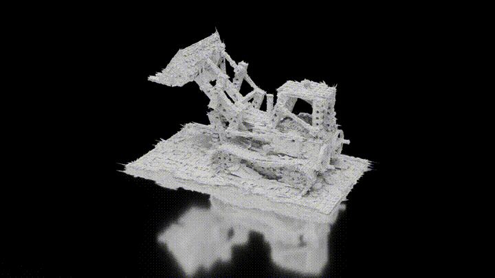

# MeshSplats
Rafał Tobiasz*, Grzegorz Wilczyński*, Marcin Mazur, Sławomir Tadeja, Przemysław Spurek
(* indicates equal contribution)<br>

This repository contains the official authors implementation associated 
with the paper ["MeshSplats: Mesh-Based Rendering with Gaussian Splatting Initialization"](https://arxiv.org/pdf/2502.07754).

Abstract: *
Recently, a range of neural network-based methods for image rendering have been introduced. Gaussian Splatting (GS) is a recent and pivotal technique in 3D computer graphics. GS-based algorithms almost always bypass classical methods such as ray tracing, which offers numerous inherent advantages for rendering. For example, ray tracing is able to handle incoherent rays for advanced lighting effects, including shadows and reflections. To address this limitation, we introduce MeshSplats, a method which converts GS to a mesh-like format. Following the completion of training, MeshSplats transforms Gaussian elements into mesh faces, enabling rendering using ray tracing methods with all their associated benefits. Our model can be utilized immediately following transformation, yielding a mesh of slightly reduced quality without additional training. Furthermore, we can enhance the reconstruction quality through the application of a dedicated optimization algorithm that operates on mesh faces rather than Gaussian components. The efficacy of our method is substantiated by experimental results, underscoring its extensive applications in computer graphics and image processing*

Check out this code if you just want to convert GS to a mesh and benefit from the advantages of both representations!

<div align="center">
    
    
</div>

Note: If videos aren't visible you can find them in `demo` directory.

## Run our demo in Google Colab!!!

We have prepared for you a demo (to run as quickly as possible) of the MeshSplats method.

### Optimization pipeline demo
[Here's the Colab!](https://colab.research.google.com/drive/1N6Y6TfijUw9tQ8vrnoLrAhBPlxkSzA2b?usp=sharing)

First of all, all of the data you need is [here](https://drive.google.com/drive/folders/1KjREkxiKRY-_7iDgV9q-5ItTn9rn4vPu?usp=sharing). Download it as it contains full data of one of the experiments we performed (`lego` scene from the `NeRF Synthetic` dataset with white background).

This data structure is as follows:

```
examples/
|- lego_white_background/
|  |- checkpoints/
|  |  |- best_model
|  |  |- best_model.npz
|  |- point_cloud/
|  |  |- iteration_30000/
|  |  |- point_cloud.ply
|  |- pseudomeshes/
|  |- scene_2.70_pts_8.npz
|  |- cameras.json
|  |- config.yaml
|  |- colab_config.yaml
|- lego.zip
```
Where:
- `checkpoints` contains the best model from our optimization pipeline as torch checkpoint and numpy checkpoint,
- `point_cloud` contains the point cloud of the scene from the 30000 iteration of the GaMeS algorithm,
- `pseudomeshes` contains the raw pseudomesh of the scene generated from the available `point_cloud.ply` file,
- `cameras.json` contains the camera poses,
- `config.yaml` contains the config of the experiment.  
- `colab_config.yaml` contains the config of the experiment for the colab demo,
- `lego.zip` contains the data of the `lego` scene from the `NeRF Synthetic` dataset.
## Installation

```bash
pip install -r requirements.txt
```

Also this work depends on output of the following repositories:

- [Gaussian Mesh Splatting](https://github.com/waczjoan/gaussian-mesh-splatting)
- [3D Gaussian Splatting](https://github.com/graphdeco-inria/gaussian-splatting)
- [2D Gaussian Splatting](https://github.com/hbb1/2d-gaussian-splatting)

Therefore, you need to install them first.

## Usage

You can find the scripts for running the experiments in the `sh_scripts` folder. Remember to change all paths to the correct ones in the scripts. We provided configs for the experiments in the `sh_scripts/configs` folder (once again remember to change the paths).

Each script is designed to run on a single GPU.

For example, to run the experiments for the DeepBlending dataset with the GaMeS algorithm, you can use the following command:

```bash
./sh_scripts/run_games_gs-flat_sh0_db.sh
```

## Datasets
This repository is prepared to work with the following datasets (as you can see in the `sh_scripts` scripts):

- NeRF-Synthetic
- Tanks and Temples
- MiP NeRF
- DeepBlending

<section class="section" id="BibTeX">
  <div class="container is-max-desktop content">
    <h2 class="title">BibTeX</h2>
<h3 class="title">MeshSplats</h3>
    <pre><code>@Article{tobiasz2025meshsplats,
        author={Rafał Tobiasz and Grzegorz Wilczyński and Marcin Mazur and Sławomir Tadeja and Przemysław Spurek},
        year={2025},
        eprint={2502.07754},
        archivePrefix={arXiv},
        primaryClass={cs.GR},
}
</code></pre>
    <h3 class="title">Gaussian Splatting</h3>
    <pre><code>@Article{kerbl3Dgaussians,
      author         = {Kerbl, Bernhard and Kopanas, Georgios and Leimk{\"u}hler, Thomas and Drettakis, George},
      title          = {3D Gaussian Splatting for Real-Time Radiance Field Rendering},
      journal        = {ACM Transactions on Graphics},
      number         = {4},
      volume         = {42},
      month          = {July},
      year           = {2023},
      url            = {https://repo-sam.inria.fr/fungraph/3d-gaussian-splatting/}
}</code></pre>
</code></pre>
    <h3 class="title">NVDiffrast</h3>
    <pre><code>@Article{laine2020modularprimitiveshighperformancedifferentiabl,
      author         = {Kerbl, Bernhard and Kopanas, Georgios and Leimk{\"u}hler, Thomas and Drettakis, George},
      title={Modular Primitives for High-Performance Differentiable Rendering}, 
      author={Samuli Laine and Janne Hellsten and Tero Karras and Yeongho Seol and Jaakko Lehtinen and Timo Aila},
      year={2020},
      eprint={2011.03277},
      archivePrefix={arXiv},
      primaryClass={cs.GR},
}</code></pre>
  </div>
</section>
