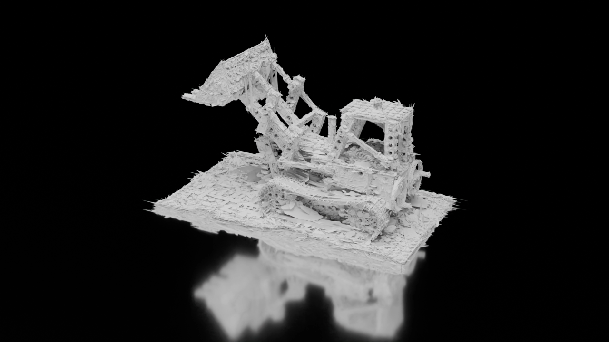
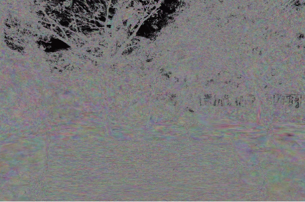

# MeshSplats

This repository contains the code for the MeshSplats paper. With our work you can transform 3D or 2D Gaussians into a mesh and benefit from the advantages of both representations!

<div align="center">
  <a href="./demo/vis_1.mp4" style="display:inline-block; margin-right:1%;">
    
  </a>
  <a href="./demo/vis_bicycle_2.mp4" style="display:inline-block;">
    
  </a>
</div>

Note: If videos aren't visible you can find them in `demo` directory.


## Installation

```bash
pip install -r requirements.txt
```

Also this work depends on output of the following repositories:

- [Gaussian Mesh Splatting](https://github.com/waczjoan/gaussian-mesh-splatting)
- [3D Gaussian Splatting](https://github.com/graphdeco-inria/gaussian-splatting)
- [2D Gaussian Splatting](https://github.com/hbb1/2d-gaussian-splatting)

Therefore, you need to install them first.

## Usage

You can find the scripts for running the experiments in the `sh_scripts` folder. Remember to change all paths to the correct ones in the scripts. We provided configs for the experiments in the `sh_scripts/configs` folder (once again remember to change the paths).

Each script is designed to run on a single GPU.

For example, to run the experiments for the DeepBlending dataset with the GaMeS algorithm, you can use the following command:

```bash
./sh_scripts/run_games_gs-flat_sh0_db.sh
```

## Datasets
This repository is prepared to work with the following datasets (as you can see in the `sh_scripts` scripts):

- NeRF-Synthetic
- Tanks and Temples
- MiP NeRF
- DeepBlending
